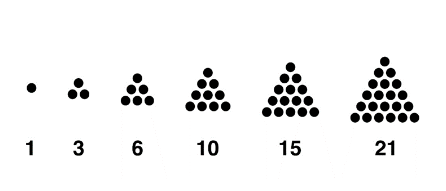

# Codewars Valencia 2025 del 1 al 10


## 1. Moviegoers
**Puntos:** 1

### Introducción
Stanley y Alfred han comprado entradas para un cine y quieren ir directamente a la sala de proyección. Stanley debe pasar primero a recoger a Alfred en su casa antes de ir al cine. Se da el tiempo que tarda en llegar a la casa de Alfred y el tiempo desde la casa de Alfred hasta el cine. Dado el minuto del día en que comienza la película, se pregunta a qué hora debe salir Stanley para no llegar tarde.

### Entrada
Tres líneas:
- Primer línea: duración en minutos para llegar a la casa de Alfred.
- Segunda línea: duración en minutos para ir de la casa de Alfred al cine.
- Tercer línea: minuto del día en que empieza la película.

### Salida
Un solo entero: el último minuto del día en el que Stanley puede comenzar a conducir para llegar a tiempo.

### Ejemplo
Entrada:
```
10
4
1335
```
Salida:
```
1321
```

***

## 2. FizzBuzz
**Puntos:** 3

### Introducción
Contar desde un número m hasta n con las siguientes condiciones del juego FizzBuzz:
- Múltiplos de 3: imprimir "Fizz"
- Múltiplos de 5: imprimir "Buzz"
- Múltiplos de 3 y 5: imprimir "FizzBuzz"

### Entrada
Dos líneas:
- Primera línea: m, número inicial.
- Segunda línea: n, número final.

### Salida
Impresión de números o palabras según las reglas.

### Ejemplo
Entrada:
```
1
5
```
Salida:
```
1
2
Fizz
4
Buzz
```

***

## 3. RoboCup Ball Position
**Puntos:** 3

# Introducción

Esta es una historia real. Todos los personajes descritos en esta historia han sido modificados para proteger su identidad.

En 2011, mientras participábamos en la competencia RoboCup de fútbol (una competencia de robots autónomos para jugar fútbol), desarrollamos cámaras estereoscópicas (es decir, dos cámaras) montadas en el techo que podían seguir la pelota y proporcionar las coordenadas 3D de la pelota (X, Y, Z). 

Solo había un problema: la posición se daba usando una de las cámaras como referencia, pero necesitábamos que el centro del campo fuera la referencia.

Por lo tanto, tomamos algunas mediciones:

- Cuando la pelota estaba en la posición (0, 0, 0) del campo, el sistema de cámaras estereoscópicas marcó (-0.378094, -0.044534, 3.54707).
- Cuando la pelota estaba en la posición (0, 0, 1) del campo, el sistema de cámaras estereoscópicas marcó (-0.460408, -0.74951, 2.91714).
- Cuando la pelota estaba en la posición (-1, 0, 0) del campo, el sistema de cámaras estereoscópicas marcó (0.427701, -0.555208, 3.98178).
- Cuando la pelota estaba en la posición (0, 1, 0) del campo, el sistema de cámaras estereoscópicas marcó (0.288779, 0.451449, 2.93639).
- Cuando la pelota estaba en la posición (1, 1, 0) del campo, el sistema de cámaras estereoscópicas marcó (-0.517016, 0.962123, 2.50168).
- Cuando la pelota estaba en la posición (1, 0, 0) del campo, el sistema de cámaras estereoscópicas marcó (-1.183889, 0.46614, 3.11236).
- Cuando la pelota estaba en la posición (-1, -1, 0) del campo, el sistema de cámaras estereoscópicas marcó (0.77, -0.208, 1.8878).
- Cuando la pelota estaba en la posición (1, -1, 1) del campo, el sistema de cámaras estereoscópicas marcó (1.111, 0.872364, -1.6786).

Estos valores son las mediciones reales, así que no esperes que los resultados sean números enteros redondeados.


### Entrada
Una línea: tres enteros separados por comas, entre -1 y 1.

### Salida
Si la posición corresponde a una de las posiciones conocidas, imprimir las coordenadas de la cámara con 6 decimales. Si no, imprimir: "INVALID POSITION".

### Ejemplo 1
Entrada:
```
0,0,1
```
Salida:
```
-0.460408,-0.749510,2.917140
```

### Ejemplo 2
Entrada:
```
0,1,0
```
Salida:
```
0.288779,0.451449,2.936390
```

### Ejemplo 3
Entrada:
```
-1,0,1
```
Salida:
```
INVALID POSITION
```

***

## 4. DAC Conversion
**Puntos:** 4

# Introducción

En electrónica, un convertidor digital a analógico (DAC) es un dispositivo que transforma una señal binaria en una salida analógica. Por ejemplo, un DAC de 8 bits puede representar hasta 256 valores diferentes, con cada paso que difiere en 1/256 del valor a escala completa, lo que define la resolución del sistema.

Vamos a crear un programa que convierta una representación decimal de una señal en el nivel de voltaje analógico correspondiente producido por un DAC. Dado un rango de valores de 0 a 1023 y un rango de referencia de 0 a 5.00 voltios, el valor y la referencia son directamente proporcionales.

## Entrada

La entrada es un número entero positivo con resolución de 10 bits.

## Salida

La salida es el voltaje de referencia redondeado a dos decimales.

## Ejemplos

| Entrada | Salida  |
|---------|---------|
| 0       | 0.00 V  |
| 1023    | 5.00 V  |
| 356     | 1.74 V  |
| 2       | 0.01 V  |


***

## 5. Recover Information
**Puntos:** 4
# Introducción

Estás trabajando en la recuperación de datos de un sistema RAID que ha sufrido corrupción en uno de sus discos duros. En este sistema, la información redundante se almacena en un disco adicional para asegurar la integridad de los datos. Tu tarea es restaurar la información del disco duro dañado utilizando el disco de redundancia.

La primera línea de entrada representa el contenido del disco duro RAID que funciona correctamente (disco de datos), mientras que la segunda línea representa el contenido del disco de redundancia (disco de paridad). Tu objetivo es combinar los datos de estos dos discos usando una operación NAND. La lógica de la operación NAND se define como sigue:

0 NAND 0 = 1  
0 NAND 1 = 1  
1 NAND 0 = 1  
1 NAND 1 = 0  

¿Puedes escribir un programa que combine los datos del disco de datos y el disco de paridad según esta operación NAND?

## Entrada

Se te proporcionarán dos líneas de entrada, cada una representando el contenido de uno de los discos en formato binario. Ambas líneas tendrán la misma longitud.

## Salida

Imprime una sola línea que represente el resultado de aplicar la operación NAND entre las dos líneas de entrada.

## Ejemplo

Entrada
```
11001  
10110  
```
Salida
```
01111
```


***

## 6. Climbing And Descending
**Puntos:** 4

# Introducción

Imagina que estás en una aventura de senderismo, escalando una montaña. Tu viaje comienza en la base y asciendes de manera constante, paso a paso, hasta llegar a la cima. En la cima, te tomas un momento para disfrutar de la vista impresionante. Después, comienzas el descenso, bajando cuidadosamente por el otro lado de la montaña hasta llegar nuevamente a la base.

En este problema, una secuencia de números representa tu recorrido. Los números deben primero aumentar, simbolizando la subida a la montaña, y luego disminuir, simbolizando el descenso. Tu tarea es determinar si la secuencia de números sigue este patrón de subir a una cima y luego descender, tal como una caminata perfecta en la montaña. Si la secuencia cumple con este patrón, significa que subiste y bajaste con éxito la montaña. Si no, significa que tu recorrido no siguió el camino esperado.

## Entrada

La entrada consiste en:  
- La primera línea contiene un entero **N**, el número de elementos que componen el recorrido.  
- Las siguientes **N** líneas contienen cada una un entero positivo, que representa los elementos de la secuencia.

## Salida

Imprime `"True"` si la secuencia primero aumenta estrictamente y luego disminuye estrictamente. De lo contrario, imprime `"False"`.

## Ejemplos

Ejemplo 1  
Entrada:
```
3  
4  
5  
6  
```
Salida:  
```
False  
```

Ejemplo 2  
Entrada: 
```
6  
1  
3  
4  
12  
10  
9
```
Salida:  
True  

Ejemplo 3  
Entrada:  
```
5  
1  
3  
2  
1  
5
```
Salida:  
```
False
```

Ejemplo 4  
Entrada:  
```
5  
4  
3  
2  
1  
2
```
Salida:  
```
False
```


## 7. The Easter Bunny Problem
**Puntos:** 4

# Introducción

Este año, el Conejo de Pascua visitó las pirámides egipcias y quedó fascinado. Para rendirles homenaje, quiere esconder los huevos formando una figura perfectamente triangular. Esta es la idea que tiene en mente:



Con 1 huevo, SE PUEDE formar una estructura perfectamente triangular, y con 3, y con 6, ... Pero no funcionaría con 2 huevos, ni con 4, ni con 5, … ¿Puedes ayudarle a determinar si, con un número N de huevos, puede construir lo que quiere?

## Entrada

La entrada consta de dos partes:

- La primera parte es una línea con un solo entero T.
- La segunda parte contiene T enteros, cada uno representando el número N de huevos a esconder.

## Salida

Siguiendo el mismo orden de la entrada, se deben imprimir T líneas con "YES" si el número N de huevos sirve para formar la estructura triangular, o "NO" en caso contrario.


### Ejemplo
Entrada:
```
3
6
10
7
```
Salida:
```
YES
YES
NO
```

***

## 8. Happy Pi Day
**Puntos:** 4

# Introducción

En unos días será 14 de marzo, fecha que se celebra anualmente la constante matemática
Pi (𝜋), porque es el mes 3 seguido del día 14, que son los primeros tres dígitos de este número. Como
sabrás, Pi es la razón entre la circunferencia de un círculo y su diámetro, y es un número decimal
infinito. En 2021, el cálculo de Pi alcanzó hasta 100 billones de dígitos decimales. Pero no vayamos tan lejos y
consideremos solo los primeros cien dígitos decimales:

3.1415926535897932384626433832795028841971693993751058209749445923078164062862089986280348253421170679

Queremos explorar Pi y buscar secuencias numéricas específicas dentro de sus dígitos decimales. Dada una
secuencia de números de hasta 10 dígitos, ¿puedes escribir un programa que busque esta secuencia en los
primeros 100 dígitos decimales de Pi? Tu programa debe mostrar la posición de la primera ocurrencia de la
secuencia en Pi, o -1 si no se encuentra la secuencia.


### Ejemplo
Entrada:
```
14159
```
Salida:
```
1
```

***

## 9. La Barbacoa
**Puntos:** 4

### Introducción
Dada una parrilla con varias brochetas representadas por líneas, contar cuántas brochetas son vegetarianas (solo 'o') y cuántas no (contienen al menos una 'x').

### Entrada
Varias líneas hasta encontrar una línea con '#', cada línea representa una brocheta.

### Salida
Dos enteros: número de brochetas vegetarianas y número de no vegetarianas.

### Ejemplo
Entrada:
```
--xo--x--ox--
--xx--x--xx--
--oo--o--oo--
--xx--x--ox--
--xx--x--ox--
#
```
Salida:
```
1 4
```


***

## 10. Compound interest calculator
**Puntos:** 5

### Introducción
Calcular el dinero final que se tendrá tras invertir 1000 € a un interés compuesto dado un interés anual y número de años.

### Entrada
- Primera línea: interés anual en porcentaje (entero).
- Segunda línea: número de años (entero).

### Salida
Dinero final con dos decimales.

### Ejemplo
Entrada:
```
5
15
```
Salida:
```
2078.93
```


[1](https://codewarsbcn.hpcloud.hp.com/app/uploads/2023/12/Valencia2025.pdf)
